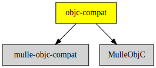

# objc-compat

#### 🔗 Glue for Objective-C code to support different Foundations

This library adds a few functions to portably write various somewhat tricky
topics such as variable arguments calls. 

It is also the place that includes the required runtime headers depending on
platform.


| Release Version                                       | Release Notes
|-------------------------------------------------------|--------------
|  [](//github.com/MulleFoundation/objc-compat/actions) | [RELEASENOTES](RELEASENOTES.md) |


## API

### Message sends

Message sending in most cases should be done by the compiler with `[]` as the
compiler knows how to handle mulle-objc messaging. You need to be sure that
the argument on the receiver side is `id` size, otherwise things break.
So any id or pointer arguments is fine. You should only call methods that
use these argument and return type exclusively:

Type      | Description
----------|-----------------------------------------------
NSInteger | is defined as `intptr_t`
NSUInteger| which is defined as `uintptr_t`
id        | or any other Objective-C instance
void *    | any pointer that can be casted to void * (not function pointers!)

As an exception to the rule, there are two functions that return BOOL instead
of id:

These are the defined message functions:

Function                 | Return Value | Arguments
-------------------------|--------------|----------------
`objc_msgSend0`          | id           | id, SEL
`objc_msgSend1`          | id           | id, SEL, id
`objc_msgSend2`          | id           | id, SEL, id, id
`objc_msgSend3`          | id           | id, SEL, id, id, id
`objc_msgSend4`          | id           | id, SEL, id, id, id, id
`objc_msgSend5`          | id           | id, SEL, id, id, id, id, id
`objc_msgSendBOOLReturn` | BOOL         | id, SEL, id
`objc_msgSendIntReturn`  | int          | id, SEL, id

These are the defined IMP calls:

Function                | Return Value | Arguments
------------------------|--------------|----------------
`objc_callIMP0`         | id           | id, SEL
`objc_callIMP1`         | id           | id, SEL, id
`objc_callIMP2`         | id           | id, SEL, id, id
`objc_callIMP3`         | id           | id, SEL, id, id, id
`objc_callIMP4`         | id           | id, SEL, id, id, id, id
`objc_callIMP5`         | id           | id, SEL, id, id, id, id, id
`objc_callIMPIntReturn` | int          | id, SEL, id


> #### Note
>
> Casting to BOOL should be done like 
> `(BOOL) (intptr_t) objc_callIMP( self, @selector( foo))`, as otherwise the
> compiler may potentially use the wrong bits .
>


### Stack allocation

To portably use `alloca`, there exists a function called `objc_alloca`, it is
supposed to do "the right thing", depending on platform.

See alloca(3) for the alloca semantics. `objc_alloca` is different though. If
the alloca block is too large to be put on the stack, it will be allocated
with autorelease semantics instead.  Since it may use
`NSMutableData` for this, you need this class defined somewhere.


| Function        | Return Value | Arguments
|-----------------|--------------|----------------
| `objc_alloca`   | void  *      | bytes to allocate.


### Variable arguments

The various `va_list`, `va_start`functions and types are prefixed with `objc_`.
These are to be used instead of the `<stdarg.h>` counterparts for Objective-C
methods accepting variable arguments with `...` or `va_list`.

C functions will still use `<stdarg.h>`. Note that `va_list` and `objc_va_list`
are different types and not compatible

| `va_list` Function | Portable function | Description
|.-------------------|-------------------|-------------------
| `va_copy`          | `objc_va_copy`    | copy variable arguments
| `va_end`           | `objc_va_end`     | end variable arguments
| `va_start`         | `objc_va_start`   | start variable arguments

Variable arguments are traversed by giving a type parameter à la `va_arg`.
The various portable functions specify implicitly the actual type family:

e.g. `va_arg( args, int)` vs. `objc_va_next_integer( args, int)`:


| Access function            | Description
|----------------------------|-------------------------------------
| `objc_va_next_fp`          | get a floating point argument of type `double` or `float`
| `objc_va_next_integer`     | get an integer argument of any signed or unsigned C integer type
| `objc_va_next_long_double` | get a floating point variable of type `long double`
| `objc_va_next_object`      | get an object argument of given type
| `objc_va_next_pointer`     | get any kind of pointer (except function pointer)
| `objc_va_next_struct`      | get any kind of `struct`
| `objc_va_next_union`       | get any kind of `union`


Thre are some shortcut functions for very common argument types, where you can omit the type parameter :

| Access function              | Description
|------------------------------|-------------------------------------
| `objc_va_next_char_pointer`  | get a `char *`
| `objc_va_next_double`        | get a `double`
| `objc_va_next_id`            | get a `id`
| `objc_va_next_int`           | get an `int`

To write portable code that accepts `objc_va_list` use the provided `#define objcVarargList` instead of
`arguments:` on Apple or `mulleVarargList;` on MulleObjC.


#### Example:


``` objc
- (void) foo:(id) arg, ...
objcVarargList:(objc_va_list) args
{
   NSUInteger   n;
   NSString     *s;

   s = objc_va_next_object( args, NSString *);
   n = objc_va_next_integer( args, NSInteger);
}

- (void) foo:(id) arg, ...
{
   objc_va_list  args;

   objc_va_start( args, arg);
   [self foo:arg objcVarargList:args];
   objc_va_end( args);
}
```

### In memory instance allocation

If you are allocating instances "manually", you need to use these two functions
to convert from allocation to the instance and back:

| Function            | Description
|---------------------|--------------
| `objc_getInstance`  | Convert a block of memory to an object pointer
| `object_getAlloc`   | Retrieve block of memory from the object pointer


Here is how to determine the location of extra bytes:

``` c
static void  get_extra_bytes( id self)
{
   size_t    size;
   id        alloc;

   size  = class_getInstanceSize( object_getClass( self));
   alloc = object_getAlloc( self);
   return( (void *) &((char *) alloc)[ size]);
}
```

#### Example:

``` c
   len = class_getInstanceSize( cls);
   p   = calloc( 1, len);
   obj = objc_getInstance( p);  // uninitialized, no isa!!
   p   = object_getAlloc( obj);
   free( p);
```


## Usage

[mulle-gdb](//github.com/mulle-cc/mulle-gdb) recognizes a lot of the
symbols contained in `objc-compat`. So if you link **objc-compat** (with
mulle-sde dependency unmark `no-all-load`), then you'll have a much easier
time debugging your executables.


> #### Note
>
> You should `#import` this header and not `#include` it in a mulle-sde 
> setting, so that the `#import <Foundation/Foundation.h>` appears beforehand.
> This is a header-only library. It will not be "buildable" in CLion.


| Runtime    |  Selection
|------------|---------------------
| mulle-objc | `defined( __MULLE_OBJC__)`
| Apple      | `! defined( __MULLE_OBJC__) && defined( __APPLE__)`
| GnuSTEP    | not yet
| Cocoatron  | not yet
| FW         | not yet


## Requirements

|   Requirement         | Release Version  | Description
|-----------------------|------------------|---------------
| [MulleObjC](https://github.com/mulle-objc/MulleObjC) |  [](https://github.com/mulle-objc/MulleObjC/actions/workflows/mulle-sde-ci.yml) | 💎 A collection of Objective-C root classes for mulle-objc
| [mulle-objc-compat](https://github.com/mulle-objc/mulle-objc-compat) |  [](https://github.com/mulle-objc/mulle-objc-compat/actions/workflows/mulle-sde-ci.yml) | 🍏 Compatibility layer with Apple Objective-C runtime functions

### You are here



## Add

Use [mulle-sde](//github.com/mulle-sde) to add objc-compat to your project:

``` sh
mulle-sde add github:MulleFoundation/objc-compat
```

## Install

Use [mulle-sde](//github.com/mulle-sde) to build and install objc-compat and all dependencies:

``` sh
mulle-sde install --prefix /usr/local \
   https://github.com/MulleFoundation/objc-compat/archive/latest.tar.gz
```

### Legacy Installation

Install the requirements:

| Requirements                                 | Description
|----------------------------------------------|-----------------------
| [MulleObjC](https://github.com/mulle-objc/MulleObjC)             | 💎 A collection of Objective-C root classes for mulle-objc
| [mulle-objc-compat](https://github.com/mulle-objc/mulle-objc-compat)             | 🍏 Compatibility layer with Apple Objective-C runtime functions

Download the latest [tar](https://github.com/MulleFoundation/objc-compat/archive/refs/tags/latest.tar.gz) or [zip](https://github.com/MulleFoundation/objc-compat/archive/refs/tags/latest.zip) archive and unpack it.

Install **objc-compat** into `/usr/local` with [cmake](https://cmake.org):

``` sh
cmake -B build \
      -DCMAKE_INSTALL_PREFIX=/usr/local \
      -DCMAKE_PREFIX_PATH=/usr/local \
      -DCMAKE_BUILD_TYPE=Release &&
cmake --build build --config Release &&
cmake --install build --config Release
```

## Author

[Nat!](https://mulle-kybernetik.com/weblog) for Mulle kybernetiK  


